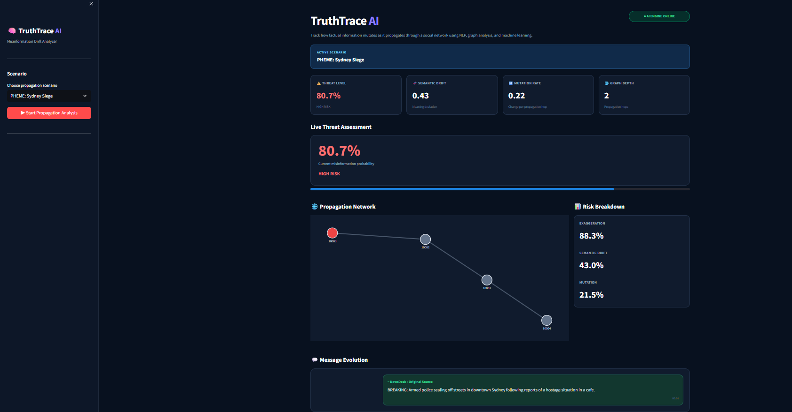
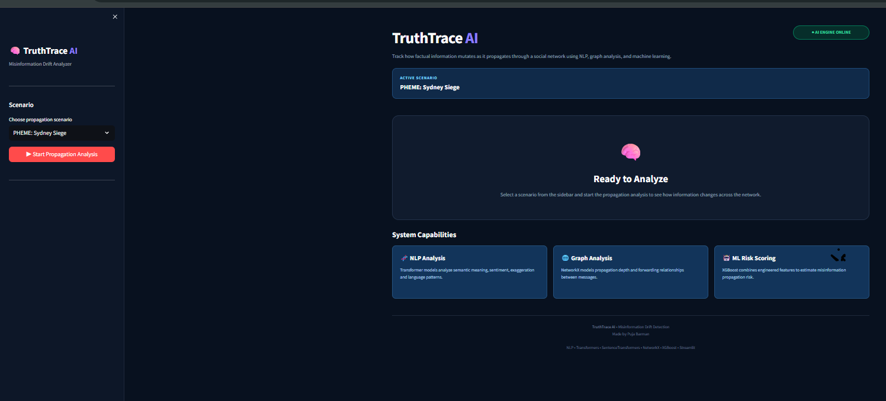

# 🧠 TruthTrace AI

**TruthTrace AI — Message Propagation & Semantic Mutation Tracker**

An end-to-end Machine Learning pipeline that tracks, quantifies, and visualizes how factual information mutates into dangerous misinformation as it propagates through a social network. TruthTrace AI uses HuggingFace Transformers, graph theory, and XGBoost to calculate a live **Threat Level** for a forwarding chain, hop by hop.

Made by **Puja Barman**.

---

## 📸 Demo & Screenshots




---

## ✨ What It Does

- **Live threat scoring** — every forwarded message is scored for misinformation risk in real time (Safe / Suspicious / High Risk).
- **Message Evolution feed** — the full mutation chain builds up message-by-message, with newly introduced words highlighted in red against the original source.
- **Propagation Network graph** — an interactive node graph shows who forwarded what, and how far a message has traveled from its source.
- **Risk breakdown** — exaggeration, semantic drift, and mutation rate are broken out individually, not just as one blended score.
- **AI Threat Analysis** — an expandable readout under each forwarded message shows the exact feature values the model used to score it.
- **Built-in scenarios** — PHEME: Sydney Siege (real nested-thread structure) and a Financial Bank Scam chain, plus a Custom Input mode to write your own rumor chain and watch it evolve.

---

## 🛠️ Tech Stack

**Frontend & Visualization**
- **Streamlit** — interactive web dashboard
- **Plotly** — live network graph rendering
- **Custom HTML/CSS** — dark dashboard theme with metric cards and `difflib`-based text diff highlighting

**Machine Learning & NLP (local inference)**
- **HuggingFace Transformers** — `cross-encoder/nli-distilroberta-base` (zero-shot exaggeration detection)
- **SentenceTransformers** — `all-MiniLM-L6-v2` (semantic drift via cosine similarity)
- **XGBoost** — `XGBClassifier` (misinformation risk probability)
- **NetworkX** — graph topology and propagation-depth modeling
- **Data processing** — Pandas, NumPy, Scikit-learn

---

## 🧠 Architecture & Approach

TruthTrace AI avoids black-box LLM APIs in favor of a deterministic, locally-hosted architecture split into two pipelines:

1. **Offline Training Pipeline** — ingests nested, non-linear social media threads (e.g. the PHEME dataset), engineers features like *semantic drift* and *information mutation rate* using Transformer embeddings and graph metrics, and trains an XGBoost classifier to output a calibrated risk probability.
2. **Online Inference Engine** — a real-time Streamlit dashboard that replays a message chain one hop at a time, recalculating live feature deltas and updating the dashboard without recomputing the entire graph from scratch.

---

## 🔄 System Process Flow

1. **Scenario selection** — pick a pre-loaded dataset (e.g. Sydney Siege) or write a custom rumor chain.
2. **NLP feature extraction** — each message is passed through DistilRoBERTa and MiniLM to get semantic embeddings and an exaggeration probability.
3. **Graph topology update** — NetworkX updates the propagation DAG to calculate hop depth and branching.
4. **Threat scoring** — the feature vector `[semantic_drift, sentiment_delta, exaggeration_score, graph_depth, mutation_rate]` is passed to the cached XGBoost model.
5. **Dashboard update** — the Threat Level card, Propagation Network graph, and Risk Breakdown update live, and the new message is appended to the Message Evolution feed with mutated text highlighted in red.

---

## 📂 Project Structure

```text
misinformation-drift-detector/
│
├── app/
│   └── app.py                    # Streamlit dashboard & simulation loop
│
├── data/
│   ├── raw/                      # Optional: raw dataset JSONs
│   ├── synthetic_chains.json     # Sample synthetic propagation chains
│   └── models/
│       └── xgb_model.pkl         # Trained XGBoost artifact
│
├── demo/                         # Screenshots for README
│
├── src/
│   ├── __init__.py
│   ├── data_model.py             # Message dataclass definition
│   ├── graph_model.py            # NetworkX graph topology engine
│   │
│   ├── data_pipeline/
│   │   └── dataset_parser.py     # Parses complex thread trees (PHEME format)
│   │
│   ├── ml/
│   │   ├── feature_engineer.py   # Maps text/graph data to tabular Pandas structures
│   │   └── train_model.py        # XGBoost training and evaluation script
│   │
│   └── nlp/
│       └── transformer_engine.py # HuggingFace inference pipelines
│
├── requirements.txt
├── .gitignore
└── README.md
```

---

## 🚀 Setup Instructions

**1. Clone the repository**
```bash
git clone https://github.com/yourusername/misinformation-drift-detector.git
cd misinformation-drift-detector
```

**2. Create and activate a virtual environment**
```bash
# Windows
python -m venv venv
venv\Scripts\activate

# Mac/Linux
python3 -m venv venv
source venv/bin/activate
```

**3. Install dependencies**

*Note: this project uses the CPU-only build of PyTorch for lightweight, portable deployment.*
```bash
pip install torch torchvision torchaudio --index-url https://download.pytorch.org/whl/cpu
pip install -r requirements.txt
```

**4. Train the ML model (offline pipeline)**

*Run this once before launching the app — it generates the `.pkl` artifact the dashboard loads.*
```bash
python src/ml/train_model.py
```

**5. Launch the application**
```bash
streamlit run app/app.py
```

---

## 👤 Author

**Puja Barman**